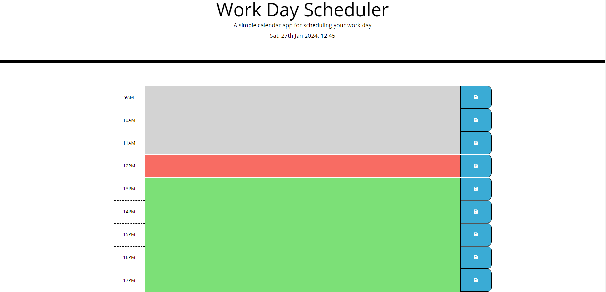
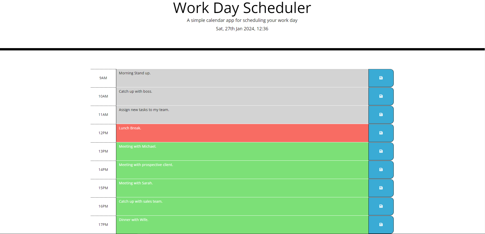

# Third-Party APIs: Work Day Scheduler

A full stack calendar app created using [Day.js](https://day.js.org/en/)

## Description
For this project, I have been tasked with creating a simple full stack calendar application that allows a user to save events for each hour of the day. This app will run in the browser and feature dynamically updated HTML and CSS powered by jQuery.

For more details, please see below [User Story](#user-story) and [Acceptance Criteria](#acceptance-criteria)

## Links

[Deployed Link 🔗](TO BE CONFIRMED)

[GitHub Repository 🔗](https://github.com/aaron1490/calendar-application)

## Technical Stack

* HTML5
* CSS
* JavaScript

* Frameworks
  * [Bootstrap](https://getbootstrap.com/)

* Libraries
  * [jQuery](https://jquery.com/)
  * [Day.js](https://day.js.org/)


## Installation

To install and edit this project, please clone the repository and make any necessary changes.

The repository can be found at this [🔗link](https://github.com/aaron1490/calendar-application)

## Usage

To open and use this application, please open the app via the [🔗link](TO BE CONFIRMED)

## Features

Some noteable features include:
* Displays the current day, date and time at the top of the calender when a user opens the planner.
* Users have timeblocks for each hour of the day between 09:00 - 17:00, as the day progresses, timeblocks in the past will change to grey, the current timeblock will be red and timeblocks in the future are green.
* Users can enter an event when they click a timeblock, these event's can be saved with the save button icon locally. These events are then kept in local storage and retrieved the next time the page is loaded.

## Project Demo

When opened, the app should look like this:


Times in the past will be grey, the current timeblock will be red and times in the future will be green.

Enter certain meetings in for the hours in the calendar and press the save icon on the right. Like such:


These entries are saved locally and upon page refresh, the input will still be displayed in the calendar time blocks.


## Your Task

Create a simple calendar application that allows a user to save events for each hour of the day by modifying starter code. This app will run in the browser and feature dynamically updated HTML and CSS powered by jQuery.

You'll need to use the [Day.js](https://day.js.org/docs/en/display/format) library to work with date and time. Be sure to read the documentation carefully and concentrate on using Day.js in the browser.

## User Story

```md
AS AN employee with a busy schedule
I WANT to add important events to a daily planner
SO THAT I can manage my time effectively
```

## Acceptance Criteria

The app should:

* Display the current day at the top of the calender when a user opens the planner.
 
* Present timeblocks for standard business hours when the user scrolls down.
 
* Color-code each timeblock based on past, present, and future when the timeblock is viewed.
 
* Allow a user to enter an event when they click a timeblock

* Save the event in local storage when the save button is clicked in that timeblock.

* Persist events between refreshes of a page

The following animation demonstrates the application functionality:


---
© 2024 edX Boot Camps LLC. Confidential and Proprietary. All Rights Reserved.
